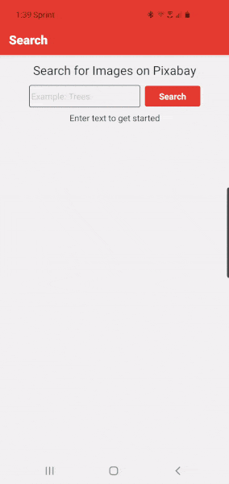

<div align="center">

# Pixabay React Native 101 Challenge

This app allows users to search for and view details about images on Pixabay.



</div>

### Tech Stack

- [React Native](https://reactnative.dev/) - used to develop the cross-platform app
- [Expo](https://docs.expo.io/) - used to develop, build, manage, and deploy the app
- [Redux](https://redux.js.org/) - used to manage the state within the React Native app

### Run the App on an Android Device

1. Download the Expo app on your Android device from the [Google Play Store](https://play.google.com/store/apps/details?id=host.exp.exponent)
2. Create an Expo account or log into your existing account
3. Tap this link and run the app [https://expo.io/@allicolyer101/react-native-101-challenge](https://expo.io/@allicolyer101/react-native-101-challenge)

### Run the App on an iOS Device

1. Download the Expo app on your iOS device from the [iOS App Store](https://apps.apple.com/us/app/expo-client/id982107779)
2. Email allicolyer@gmail.com for the username and password to sign in with
3. Once you are signed in, tap this link and run the app [https://expo.io/@allicolyer101/react-native-101-challenge](https://expo.io/@allicolyer101/react-native-101-challenge)

### Run the App from the Source Code for iOS or Android

1. Clone the repository

```
git clone https://github.com/Allicolyer/pixabay-react-native
```

2. This project requires node version `10.13.0`. If you have nvm installed, you can type `nvm use`. Otherwise, you should make sure you are running `10.13.0`.
3. Install the latest dependencies using `npm install` or `yarn install`
4. Create a [Pixabay API key](https://pixabay.com/api/docs/) and replace the PLACEHOLDER value in `.env.sample.js`
5. Rename `.env.sample.js` to `.env.js`
6. Start the app using the Expo client from the root folder `expo start`
7. Download the Expo app to run on your Android or iOS device. It's available on the [Google Play Store](https://play.google.com/store/apps/details?id=host.exp.exponent) and on the [iOS App Store](https://apps.apple.com/us/app/expo-client/id982107779). You can also use an emulator to run the app.

#### Troubleshooting

1. If there are problems related to the `.env.js` file, try stopping and restarting Expo

### Running Tests

1. The tests require node version `11.0.0`. Switch to that version before running the tests.
2. To run the tests type `yarn test` or `npm test`. This will run the Jest test suite.

### Contributors

1. This app was created by Allison Colyer
2. Big thanks to 101 for posing this challenge
3. Shout out to Pixabay for their free API

<table>
  <tr>
    <td align="center"><a href="https://github.com/allicolyer"><br /><b>Alli Colyer</b></a></td>
    <td align="center"><a href="https://www.101edu.co"><br /><b>101</b></a></td>
    <td align="center"><a href="https://pixabay.com/"><br /><b>Pixabay</b></a></td>
  </tr>
</table>
