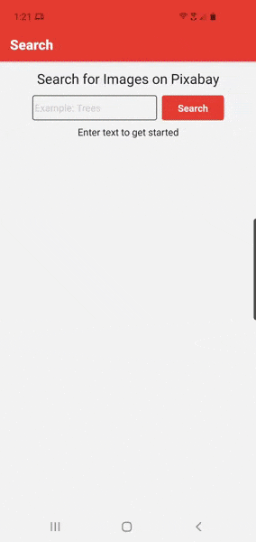

<div align="center">

# Pixabay React Native 101 Challenge

This app allows users to search for and view details about images on Pixabay.



</div>

### Tech Stack

- [React Native](https://reactnative.dev/) - used to develop the cross-platform app
- [Expo](https://docs.expo.io/) - used to develop, build, manage, and deploy the app
- [Redux](https://redux.js.org/) - used to manage the state within the React Native app

### Run the App on a mobile device

1. Download the Expo app on your Android or iOS device. It's available on the [Google Play Store](https://play.google.com/store/apps/details?id=host.exp.exponent) and on the [iOS App Store](https://search.itunes.apple.com/WebObjects/MZContentLink.woa/wa/link?path=apps%2fexponent).
2. Tap this link and run the app [https://expo.io/@allicolyer/react-native-101-challenge](https://expo.io/@allicolyer/react-native-101-challenge)

### Running the Source Code

1. Fork and clone the repository

```
git clone https://github.com/Allicolyer/pixabay-react-native
```

2. Create a [Pixabay API key](https://pixabay.com/api/docs/) and replace the PLACEHOLDER value in `.env.sample.js`
3. Rename `.env.sample.js` to `.env.js`
4. Install the latest dependencies using `npm install` or `yarn install`
5. Start the app using the Expo client from the root folder `expo start`
6. Download the Expo app to run on your Android or iOS device. It's available on the [Google Play Store](https://play.google.com/store/apps/details?id=host.exp.exponent) and on the [iOS App Store](https://search.itunes.apple.com/WebObjects/MZContentLink.woa/wa/link?path=apps%2fexponent). You can also use an emulator to run the app.

### Contributors

1. This app was created by Allison Colyer
2. Big thanks to 101 for posing this challenge
3. Shoutout to Pixabay for their free API

<table>
  <tr>
    <td align="center"><a href="https://github.com/allicolyer"><br /><b>Alli Colyer</b></a></td>
    <td align="center"><a href="https://www.101edu.co"><br /><b>101</b></a></td>
    <td align="center"><a href="https://pixabay.com/"><br /><b>Pixabay</b></a></td>
  </tr>
</table>
